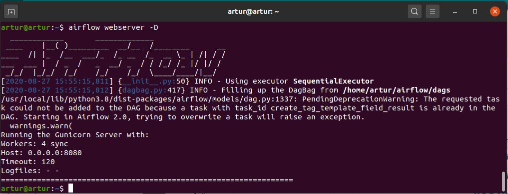
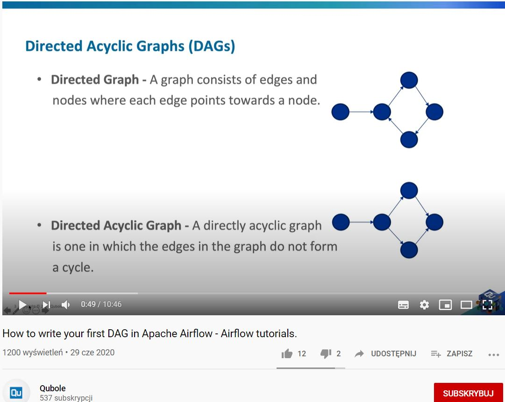
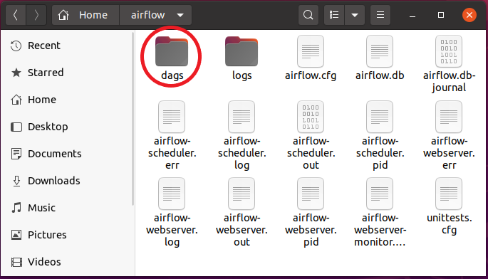
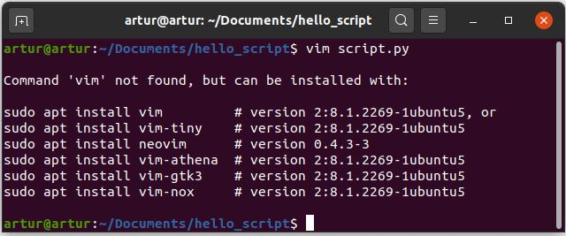

<h2>Apache Airflow for building workflows (Ubuntu server)</h2>
<h3>Setting Airflow up in the Ubuntu terminal</h3>
<ul>
  
  <li>sudo apt install python3-pip</li>
  <li>sudo pip3 install apache-airflow</li>
  <li>airflow initdb</li>
  <li>airflow webserver -p 8080</li>
  <li>airflow webserver -D -->> running airflow in the background</li>
  <li>airflow scheduler -D</li>
  <li>localhost:8080/admin</li>
  <li>ctrl + z -->>  stoping command</li>
</ul>
<h3>Directed Acyclig Graph</h3>
<ul>
  
</ul>
<h3>Downstream info flow</h3>
<ul>
  
</ul>
<h3>DAG files directory</h3>
<ul>
  
</ul>
<h3>Creating .py files</h3>
<ul>
  
</ul>

